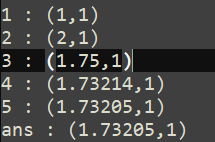
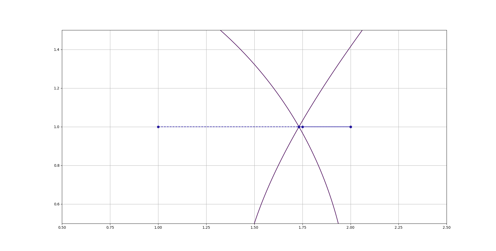
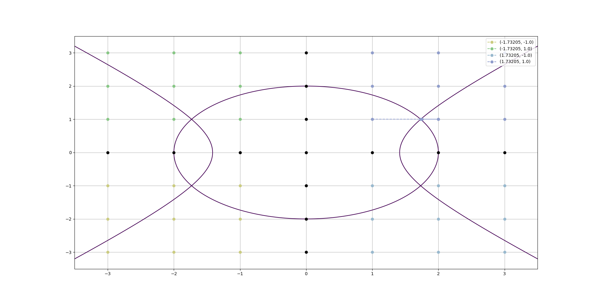
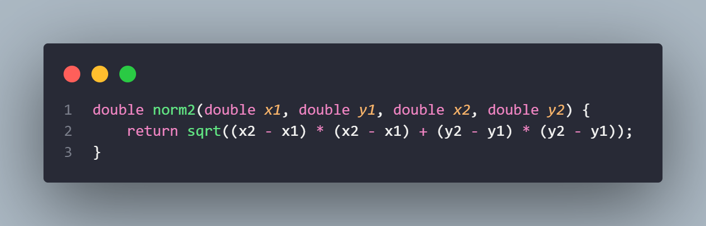
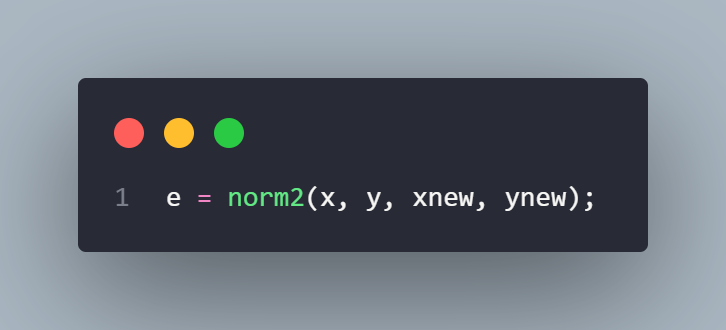
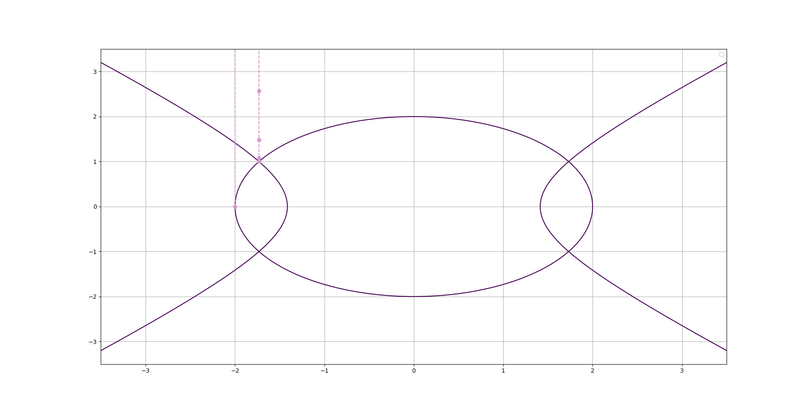

# Homework 1
00957016 高敬庭  

## [1.0, 1.0]疊代過程
格式 :   
Iteration : (Start.x, Start.y)  

對照上圖，由(1, 1)開始，第一次疊代結束後到(2, 1)，最後收斂到(1.73205, 1)，總共四個點。  

## x=-3\~3, y=-3\~3 共49點作為最初猜測

圖中右上角標示代表該顏色的點對應到的收斂結果，共有四個區域，從標示的上到下分別對應到座標中的左下、左上、右下和右上，點座標用黑色的則表示該點會發散。  

## 誤差計算方式

  
誤差計算使用2-norm的方式，呼叫方式如上圖，疊代過程請見附檔result.txt。  

## 加入Perturbation (畫圖用原(-2, 0)表示)
+ Perturbation = 0.0001

如圖所示，第一次疊代後y值衝到5000，之後每次疊代y值會大約等於前次的一半，總共經過17次疊代後收斂於(-1.73205,1)  

其餘所有點的疊代過程參考result_pertubation.txt。  
